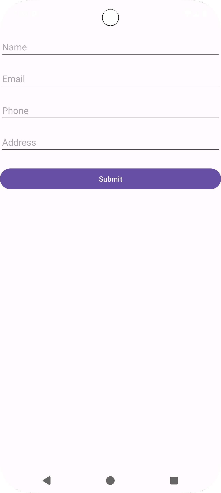
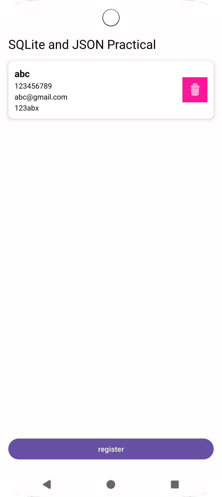

# SQLite and JSON Practical App

A simple Android application that demonstrates SQLite database operations and JSON API integration for managing person data.

## Features

- **View Data**: Display persons from both SQLite database and JSON API
- **Add Person**: Register new persons with name, email, phone, and address
- **Delete Person**: Remove persons from the list (database entries are deleted from SQLite)
- **Real-time Updates**: Automatically refreshes data when returning to main screen

## How the App Works

### Main Screen (MainActivity)

1. **On Launch**: 
   - Loads all persons from SQLite database
   - Fetches additional persons from JSON API
   - Displays combined list in RecyclerView

2. **Viewing Data**:
   - Each person is shown in a card with:
     - Name (bold)
     - Phone number
     - Email address
     - Address
   - Pink delete button on each card

3. **Deleting Persons**:
   - Tap the pink delete button on any card
   - Database entries: Deleted from SQLite and removed from list
   - JSON entries: Removed from list only

4. **Register Button**:
   - Tap "register" button at the bottom
   - Opens registration screen

### Registration Screen (RegisterActivity)

1. **Fill Form**:
   - Enter Name
   - Enter Email
   - Enter Phone
   - Enter Address

2. **Submit**:
   - Tap "Submit" button
   - Data is saved to SQLite database
   - Toast message confirms save
   - Form fields are cleared
   - Return to main screen to see new entry

3. **Back Navigation**:
   - Press back button to return to main screen
   - Main screen automatically refreshes and shows updated data

## Screenshots

<div align="center">
  
  
</div>

## Project Structure

```
app/src/main/
├── java/com/example/mad_24172012068_practical7/
│   ├── MainActivity.kt          # Main screen with list
│   ├── RegisterActivity.kt      # Registration form
│   ├── DatabaseHelper.kt        # SQLite database operations
│   ├── Person.kt                # Data model
│   ├── PersonAdapter.kt         # RecyclerView adapter
│   └── HttpRequest.kt           # JSON API calls
└── res/
    └── layout/
        ├── activity_main.xml    # Main screen layout
        ├── activity_register.xml # Registration form layout
        └── listview_component.xml # List item layout
```

## Technical Details

### Database
- **Database Name**: `testandroid`
- **Table**: `persons`
- **Columns**: id, name, emailid, phoneno, address, lat, long

### API
- **Endpoint**: `https://api.json-generator.com/templates/qjeKFdjkXCdK/data`
- **Authentication**: Bearer token required

### Permissions
- `INTERNET` - Required for JSON API calls

## Installation

1. Clone or download the project
2. Open in Android Studio
3. Sync Gradle files
4. Run on emulator or physical device

## Usage Flow

```
Launch App → Main Screen
    ↓
[View combined database + JSON data]
    ↓
Tap "register" → Registration Screen
    ↓
[Fill form → Submit → Save to database]
    ↓
Return to Main Screen → Auto-refresh → See new data
```

## Requirements

- Android Studio
- Minimum SDK: 24 (Android 7.0)
- Target SDK: 34+
- Kotlin support

## Notes

- Data persists in SQLite database across app restarts
- JSON data is fetched fresh each time app launches
- Delete functionality works differently for database vs JSON entries
- Form validation ensures all fields are filled before submission

